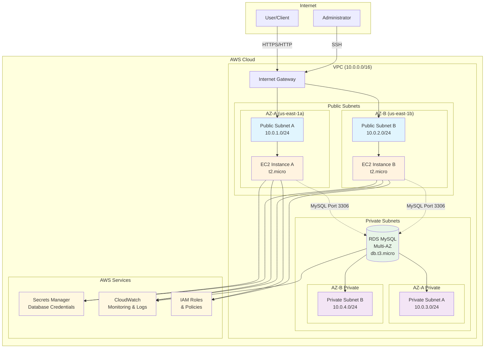
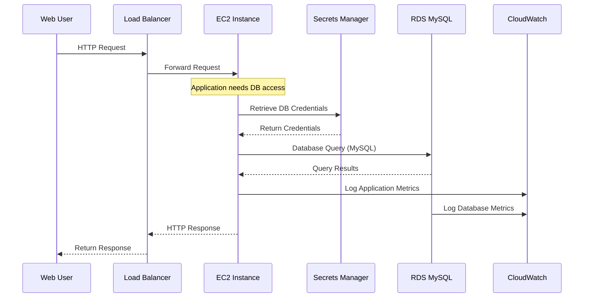

# Architecture Documentation

## Network Flow Diagrams

### High-Level Architecture Flow



### Security Group Flow

```mermaid
graph LR
    subgraph "Internet"
        Internet[Internet Traffic]
        SSHAdmin[SSH Admin<br/>Port 22]
        WebUser[Web Users<br/>Port 80/443]
    end

    subgraph "Security Groups"
        SGEC2[EC2 Security Group<br/>TechHealth-EC2-SG]
        SGRDS[RDS Security Group<br/>TechHealth-RDS-SG]
    end

    subgraph "Resources"
        EC2[EC2 Instances]
        RDS[(RDS MySQL)]
    end

    %% Inbound rules
    SSHAdmin -->|Allow SSH<br/>Port 22<br/>Specific IPs| SGEC2
    WebUser -->|Allow HTTP<br/>Port 80<br/>0.0.0.0/0| SGEC2

    %% Security group to resource
    SGEC2 --> EC2
    SGRDS --> RDS

    %% Inter-security group communication
    SGEC2 -.->|Allow MySQL<br/>Port 3306<br/>Source: EC2-SG| SGRDS

    %% Deny rules (implicit)
    Internet -.->|DENY<br/>All other traffic| SGEC2
    Internet -.->|DENY<br/>Direct access| SGRDS

    %% Styling
    classDef allow fill:#c8e6c9
    classDef deny fill:#ffcdd2
    classDef securityGroup fill:#e3f2fd

    class SGEC2,SGRDS securityGroup
```

### Data Flow Architecture



## Component Details

### VPC Configuration

**CIDR Block**: 10.0.0.0/16

- **Total IP Addresses**: 65,536
- **Available for hosts**: 65,531 (5 reserved by AWS)

**Subnet Allocation**:

- Public Subnet A (AZ-a): 10.0.1.0/24 (256 IPs)
- Public Subnet B (AZ-b): 10.0.2.0/24 (256 IPs)
- Private Subnet A (AZ-a): 10.0.3.0/24 (256 IPs)
- Private Subnet B (AZ-b): 10.0.4.0/24 (256 IPs)
- **Reserved for future expansion**: ~64,000 IPs

### Routing Tables

**Public Route Table**:

```
Destination     Target
10.0.0.0/16     Local
0.0.0.0/0       Internet Gateway
```

**Private Route Table**:

```
Destination     Target
10.0.0.0/16     Local
```

### Security Group Rules

**EC2 Security Group (TechHealth-EC2-SG)**:

```
Type        Protocol    Port    Source          Description
SSH         TCP         22      Admin IP/32     Administrative access
HTTP        TCP         80      0.0.0.0/0       Web application access
HTTPS       TCP         443     0.0.0.0/0       Secure web access
All Traffic All         All     10.0.0.0/16     VPC internal communication
```

**RDS Security Group (TechHealth-RDS-SG)**:

```
Type        Protocol    Port    Source              Description
MySQL       TCP         3306    TechHealth-EC2-SG   Database access from EC2
```

### IAM Roles and Policies

**EC2 Instance Role (TechHealth-EC2-Role)**:

```json
{
  "Version": "2012-10-17",
  "Statement": [
    {
      "Effect": "Allow",
      "Action": ["secretsmanager:GetSecretValue"],
      "Resource": "arn:aws:secretsmanager:*:*:secret:TechHealth-DB-Credentials-*"
    },
    {
      "Effect": "Allow",
      "Action": [
        "logs:CreateLogGroup",
        "logs:CreateLogStream",
        "logs:PutLogEvents"
      ],
      "Resource": "arn:aws:logs:*:*:*"
    }
  ]
}
```

## Network Connectivity Matrix

| Source       | Destination     | Protocol | Port | Access        | Purpose                        |
| ------------ | --------------- | -------- | ---- | ------------- | ------------------------------ |
| Internet     | EC2 (Public)    | TCP      | 22   | ✅ Restricted | SSH Admin Access               |
| Internet     | EC2 (Public)    | TCP      | 80   | ✅ Open       | Web Application                |
| Internet     | EC2 (Public)    | TCP      | 443  | ✅ Open       | Secure Web App                 |
| Internet     | RDS (Private)   | TCP      | 3306 | ❌ Blocked    | Security - No Direct DB Access |
| EC2 (Public) | RDS (Private)   | TCP      | 3306 | ✅ Allowed    | Application Database Access    |
| EC2 (Public) | Secrets Manager | HTTPS    | 443  | ✅ Allowed    | Credential Retrieval           |
| EC2 (Public) | CloudWatch      | HTTPS    | 443  | ✅ Allowed    | Logging and Monitoring         |

## High Availability Design

### Multi-AZ Deployment

**Availability Zones Used**:

- Primary: us-east-1a
- Secondary: us-east-1b

**Redundancy Strategy**:

- **EC2 Instances**: Deployed across both AZs
- **RDS Database**: Multi-AZ deployment with automatic failover
- **Subnets**: Each AZ has both public and private subnets

### Failover Scenarios

**RDS Failover**:

1. Primary database failure detected
2. AWS automatically promotes standby instance
3. DNS endpoint updated to point to new primary
4. Application reconnects automatically
5. Typical failover time: 60-120 seconds

**EC2 Instance Failure**:

1. Instance health check failure
2. Load balancer stops routing traffic to failed instance
3. Remaining instances handle traffic
4. Auto Scaling Group launches replacement instance (if configured)

## Security Architecture

### Defense in Depth

**Layer 1: Network Security**

- VPC isolation from internet
- Private subnets for sensitive resources
- Security groups as virtual firewalls
- NACLs for subnet-level filtering

**Layer 2: Access Control**

- IAM roles with least privilege
- No hardcoded credentials
- Secrets Manager for credential rotation
- MFA for administrative access

**Layer 3: Data Protection**

- Encryption at rest (RDS, EBS)
- Encryption in transit (TLS/SSL)
- Database connection encryption
- Secure credential storage

**Layer 4: Monitoring & Auditing**

- CloudTrail for API logging
- VPC Flow Logs for network monitoring
- CloudWatch for metrics and alarms
- Application-level logging

### HIPAA Compliance Features

**Administrative Safeguards**:

- IAM policies for access control
- CloudTrail for audit logging
- Automated backup procedures
- Incident response procedures

**Physical Safeguards**:

- AWS data center security
- Hardware security modules
- Secure disposal procedures
- Environmental controls

**Technical Safeguards**:

- Encryption at rest and in transit
- Access controls and authentication
- Audit logs and monitoring
- Data integrity controls

## Performance Considerations

### Instance Sizing

**EC2 Instances (t2.micro)**:

- vCPUs: 1
- Memory: 1 GB
- Network: Low to Moderate
- EBS-Optimized: Not supported
- **Use Case**: Development and light production workloads

**RDS Instance (db.t3.micro)**:

- vCPUs: 2
- Memory: 1 GB
- Network: Up to 5 Gbps
- EBS-Optimized: Yes
- **Use Case**: Development and small production databases

### Scaling Considerations

**Horizontal Scaling**:

- Add more EC2 instances across AZs
- Implement Application Load Balancer
- Use Auto Scaling Groups
- Consider containerization with ECS/EKS

**Vertical Scaling**:

- Upgrade to larger instance types
- Increase RDS storage and IOPS
- Add read replicas for database
- Implement caching layer (ElastiCache)

### Network Performance

**Bandwidth Limitations**:

- t2.micro: Low to Moderate network performance
- Inter-AZ traffic: Charged at $0.01/GB
- Internet egress: Charged per GB transferred

**Optimization Strategies**:

- Use CloudFront for static content
- Implement connection pooling
- Optimize database queries
- Use compression for data transfer

## Cost Architecture

### Resource Costs (Monthly Estimates)

**Compute**:

- EC2 t2.micro (2 instances): ~$16.56/month
- EBS storage (20GB each): ~$4.00/month

**Database**:

- RDS db.t3.micro: ~$15.84/month
- RDS storage (20GB): ~$2.30/month
- Backup storage: ~$0.50/month

**Networking**:

- Data transfer: Variable based on usage
- Inter-AZ transfer: ~$0.01/GB

**Total Estimated Cost**: ~$39.20/month (excluding data transfer)

### Cost Optimization Features

**Free Tier Eligible**:

- EC2 t2.micro instances (750 hours/month)
- RDS db.t3.micro (750 hours/month)
- EBS storage (30GB/month)

**Cost Reduction Strategies**:

- No NAT Gateway (saves ~$45/month)
- Minimal instance sizes
- Automated resource cleanup
- Reserved instances for production

## Disaster Recovery

### Backup Strategy

**RDS Automated Backups**:

- Daily automated backups
- 7-day retention period (configurable)
- Point-in-time recovery available
- Cross-region backup replication (optional)

**EC2 Instance Backups**:

- EBS snapshot automation
- AMI creation for quick recovery
- Configuration management with CDK
- Infrastructure as Code for rapid rebuild

### Recovery Procedures

**Database Recovery**:

1. Identify backup point for recovery
2. Create new RDS instance from backup
3. Update application configuration
4. Test database connectivity
5. Switch traffic to new instance

**Infrastructure Recovery**:

1. Deploy CDK stack to new region/account
2. Restore database from cross-region backup
3. Update DNS records
4. Validate application functionality
5. Monitor for issues

### Recovery Time Objectives

**RTO (Recovery Time Objective)**:

- Database failover: 2-5 minutes
- Infrastructure rebuild: 15-30 minutes
- Full application recovery: 30-60 minutes

**RPO (Recovery Point Objective)**:

- Database: 5 minutes (automated backups)
- Application data: 1 hour (depends on backup frequency)
- Configuration: 0 minutes (Infrastructure as Code)
