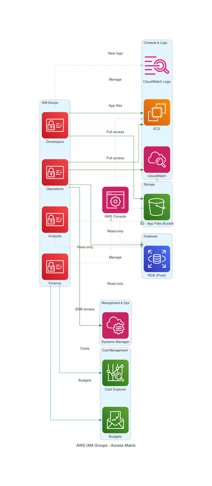

# AWS IAM Stack with CDK

This project provides a foundational AWS IAM stack created with the AWS Cloud Development Kit (CDK). It's designed to establish a secure and scalable IAM structure for a new AWS environment.

## Table of Contents

- [About the Project](#about-the-project)
- [Features](#features)
- [System Architecture](#system-architecture)
- [Getting Started](#getting-started)
  - [Prerequisites](#prerequisites)
  - [Installation](#installation)
- [Deployment](#deployment)
- [Testing](#testing)
- [Blog Post](#blog-post)

## About the Project

This project is responsible for designing and deploying the company's IAM infrastructure from the ground up. It leverages the AWS CDK to define resources as code, ensuring scalability, repeatability, and maintainability. The infrastructure is designed to support multiple environments (Production, Staging, and Testing) and utilizes a blue-green deployment strategy for seamless releases.

Security is a core focus, with strict enforcement of the principle of least privilege across all resources. This project securely creates and manages IAM users, groups, and policies to establish a strong foundation for the organization's cloud operations.

## Features

- **IAM Users:** Creates individual IAM users for team members.
- **IAM Groups:** Defines IAM groups with specific permissions.
- **IAM Policies:** Attaches fine-grained IAM policies to groups and roles.
- **IAM Roles:** Creates IAM roles for different levels of access (e.g., Analyst, Developer, Finance).
- **Multi-Environment Support:** Designed for Production, Staging, and Testing environments.
- **Blue-Green Deployments:** Enables seamless releases with minimal downtime.

## System Architecture



## Getting Started

### Prerequisites

- [AWS CLI](https://aws.amazon.com/cli/)
- [Node.js](https://nodejs.org/en/download/)
- [AWS CDK](https://docs.aws.amazon.com/cdk/latest/guide/getting_started.html)
- An AWS account with the necessary permissions

### Installation

1.  Clone the repository:
    ```bash
    git clone <repository-url>
    ```
2.  Navigate to the project directory:
    ```bash
    cd Portfolio_projects/Startco/aws-iam-stack
    ```
3.  Install the dependencies:
    ```bash
    npm install
    ```

## Deployment

To deploy the IAM stack, run the following command:

```bash
cdk deploy
```

## Testing

This project uses Bash scripts to test the functionality of the IAM roles. The test results are shown below.

### Analyst Role Test


### CDK Test


### Developer Role Test


### Finance Role Test


## Blog Post

For more information about this project, check out the Medium blog post:
[https://medium.com/@ceesay.ml](https://medium.com/@ceesay.ml)
