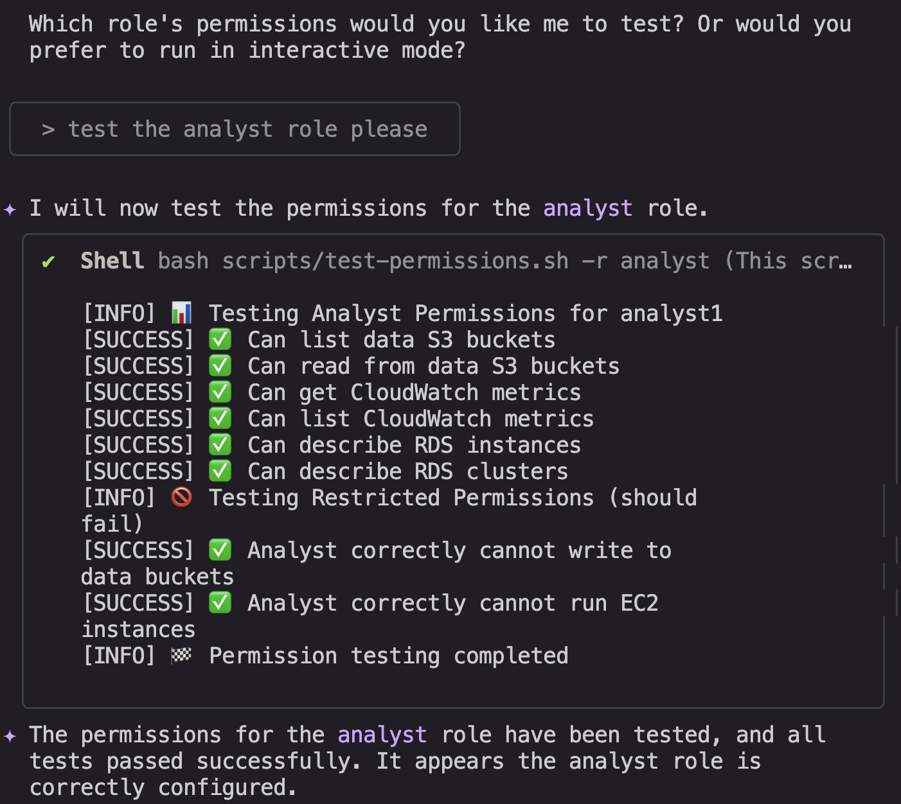

# Welcome to your CDK TypeScript project

# About

I am responsible for designing and deploying the company's infrastructure from the ground up. The project leverages AWS CDK to define resources as code, ensuring scalability, repeatability, and maintainability. To support automation and validation, we incorporate Bash scripts for testing key functionalities.

The infrastructure is structured across multiple environments — Production, Staging, and Testing — and utilizes a blue-green deployment strategy to enable seamless releases with minimal downtime. Security is a core focus, with strict enforcement of the principle of least privilege across all resources.

As this initiative is primarily centered around IAM management, most of the implementation revolves around securely creating and managing IAM users, groups, and policies to establish a strong foundation for the organization's cloud operations.

- IAM User
- IAM Group
- IAM Policy
- IAM Role

## Role Test Results

Below are screenshots of the test results for different IAM roles:

### Analyst Role Test

### CDK Test

### Developer Role Test

### Finance Role Test

System Architecture:

## Useful commands

- `npm run build` compile typescript to js
- `npm run watch` watch for changes and compile
- `npm run test` perform the jest unit tests
- `npx cdk deploy` deploy this stack to your default AWS account/region
- `npx cdk diff` compare deployed stack with
  current state
- `npx cdk synth` emits the synthesized CloudFormation template

principles Examples:
