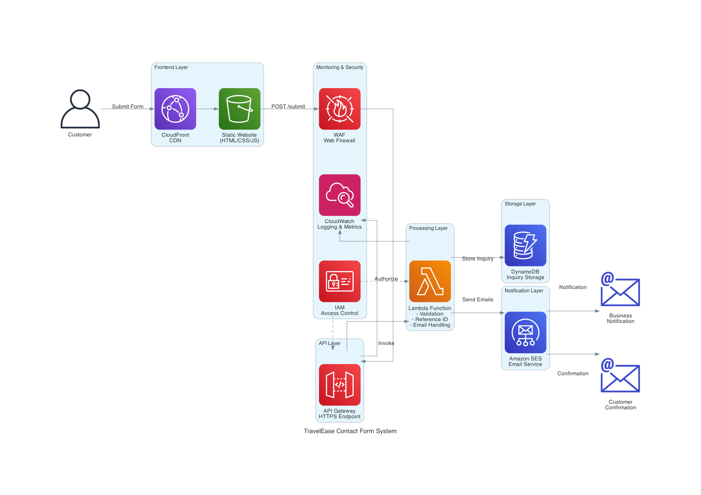
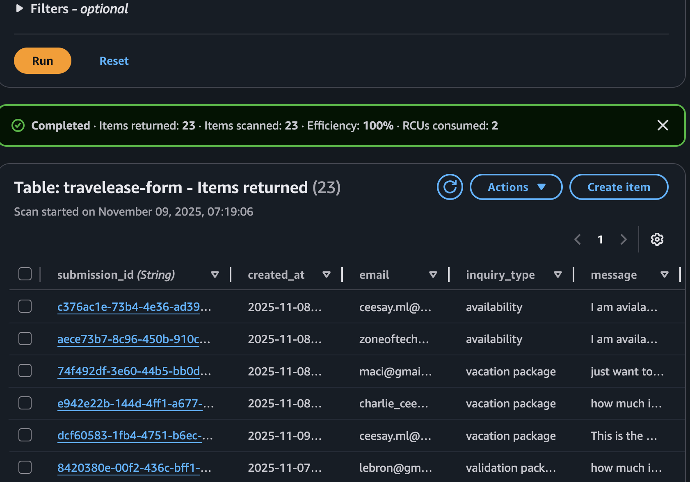
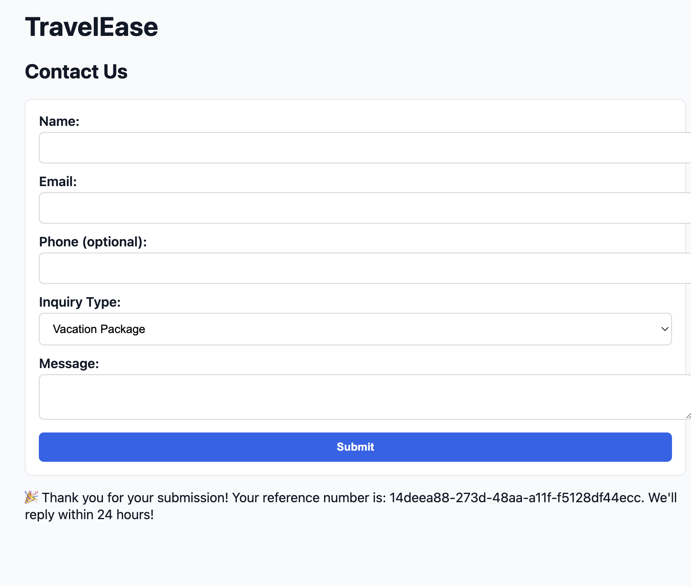
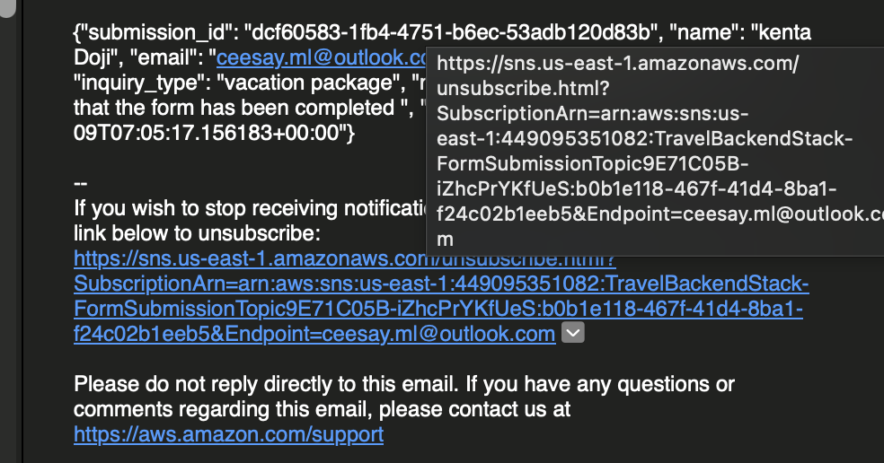
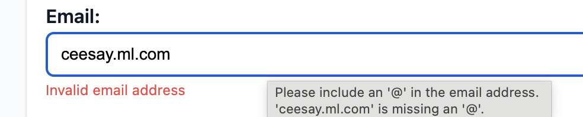

# TravelEase Portfolio Project

## Table of Contents

- [Introduction](#introduction)
- [Prerequisites](#prerequisites)
- [System Design](#system-design)
- [Project Overview](#project-overview)
- [Detailed Folder Structure](#detailed-folder-structure)
- [Frontend Development](#frontend-development)
- [Backend Development](#backend-development)
- [Email Functionality](#email-functionality)

## Introduction

This portfolio project focuses on creating a travel form that allows customers to book flights with ease. The project utilizes AWS Amplify for the frontend and AWS Lambda for serverless functionalities.

## Prerequisites

To set up and run this project, you will need:

- Node.js installed on your machine
- AWS account with Amplify CLI installed
- AWS Lambda function set up
- AWS CDK for deployment

## System Design

The overall system design for the contact form is illustrated below:


## Project Overview

The TravelEase project consists of a React + TypeScript frontend and an AWS CDK TypeScript backend.

- **Frontend**: A React + TypeScript Single Page Application (SPA) built with Vite. It uses AWS Amplify for configuration and interacts with a custom API to submit travel forms. Key files include `src/ContactForm.tsx` and `src/amplifyConfig.ts`.
- **Backend**: An AWS CDK TypeScript project (`travel_backend/`) that deploys two main stacks:
  - `TravelBackendStack`: Manages the data plane (DynamoDB, SQS) and the API Gateway.
  - `SesStack`: Configures the SES email identity for sending notifications.
    Key backend files are `travel_backend/lib/travel_backend-stack.ts` and `travel_backend/lib/ses-stack.ts`.

**Data Flow**: The UI collects form fields, posts data to an API Gateway endpoint (POST `/submit`), which triggers a Lambda function. The Lambda function handles the event, stores data in DynamoDB, and sends emails as needed, then responds with a result.

**Infrastructure Wiring Snapshot (Key Points)**:

- **DynamoDB Table**: `travelease-form` with `submission_id` as the partition key (created in `TravelBackendStack`).
- **SQS Queue**: `TravelBackendQueue` for decoupled processing.
- **Lambda Function**: `ContactFormLambda` (Python 3.11) is configured with environment variables such as `SQS_QUEUE_URL`, `DYNAMODB_TABLE_NAME`, `SOURCE_EMAIL`, `TO_EMAIL`, and `OWNER_EMAIL`.
- **HTTP API**: The `/submit` route is integrated with `ContactFormLambda` via `HttpLambdaIntegration`.
- **SES**: An email identity is configured in `SesStack`, and the Lambda function is granted permissions to send emails using this identity.

## Detailed Folder Structure

```
TravelEase/
├── src/                          # Frontend React + TypeScript SPA
│   ├── ContactForm.tsx           # Main contact form component
│   ├── App.tsx                   # Root React component
│   ├── App.css                   # Styles for the app
│   ├── main.tsx                  # Entry point for Vite
│   ├── amplifyConfig.ts          # AWS Amplify configuration
│   └── amplify_outputs.json      # Amplify generated outputs
├── travel_backend/               # Backend AWS CDK TypeScript project
│   ├── bin/
│   │   └── travel_backend.ts     # CDK app entry point
│   ├── lib/
│   │   ├── ses-stack.ts          # SES stack for email identity
│   │   └── travel_backend-stack.ts # Main backend stack (API, Lambda, DynamoDB, etc.)
│   ├── lambda/
│   │   └── app.py                # Python Lambda function for form handling
│   ├── test/
│   │   ├── test_ses.js           # Node.js SES tests
│   │   └── test_ses.py           # Python SES tests
│   ├── README.md                 # Backend-specific README
│   ├── package.json              # Backend dependencies
│   └── tsconfig.json             # TypeScript config for backend
├── system_design/                # Design assets and diagrams
│   ├── contact_form.gif
│   ├── travelease_contact_form.png
│   ├── dynamodb.png
│   ├── customer.png
│   ├── admin.png
│   └── email.png
├── .github/                      # GitHub configurations
│   └── copilot-instructions.md   # AI coding agent conventions
├── package.json                  # Frontend dependencies
├── vite.config.ts                # Vite configuration
├── index.html                    # HTML entry point
└── README.md                     # This file
```

## Frontend Development

To run the frontend application:

1.  Navigate to the `TravelEase/` directory.
2.  Install dependencies: `npm install`
3.  Start the development server: `npm run dev`

## Backend Development

To manage and deploy the backend infrastructure:

1.  Navigate to the `travel_backend/` directory.
2.  Install CDK dependencies: `npm ci`
3.  Synthesize CloudFormation template: `npx cdk synth`
4.  Compare deployed stack with current state: `npx cdk diff`
5.  Deploy the stacks to your AWS account: `npx cdk deploy`

To test the Lambda function locally using AWS SAM CLI:

```bash
sam local invoke HelloWorldFunction --env-vars env.json --event events/event.json
```

## Email Functionality

The project includes email functionality using AWS SES (Simple Email Service).

- Customer inquiries are stored in DynamoDB:
  
- A customer receipt is sent to the user's email:
  
- An admin notification email is sent to the configured owner email:
  
- Overview of SES email flow:
  
