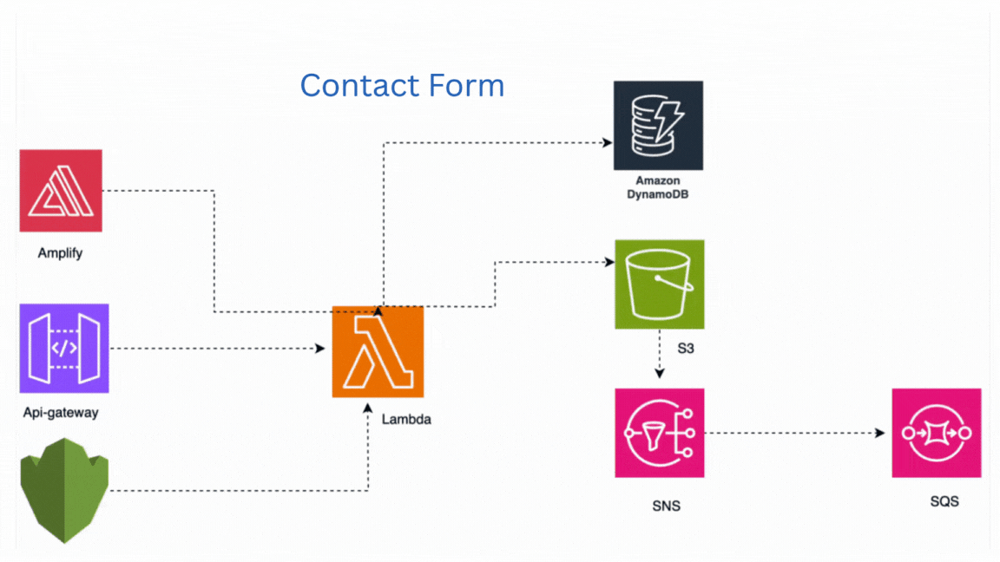

Portfolio Project:

Introduction:
This portfolio project will focus on creating a form for travelling. This should allow customers to book flights with ease. we are going to be using Amplify for the front end and we will be using lamaba for the servverless functionalities.

Prerequisites:
- Node.js installed on your machine
- AWS account with Amplify CLI installed
- AWS Lambda function set up
- aws cdk for deployment

System Design:

