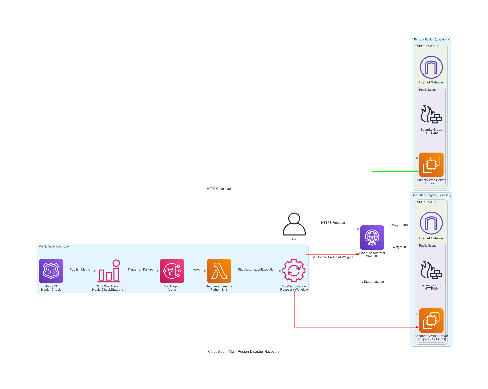

# Cloudseth

Terraform reference project from the Cloud Engineer Academy exploring fault tolerance and high availability. The stack deploys a primary/secondary EC2 pair with automated failover, recovery via SSM/Lambda, and traffic steering through AWS Global Accelerator.

## Architecture
- Primary and standby EC2 instances in separate subnets/AZs.
- SSM document and Lambda function orchestrate recovery of the standby instance during failover.
- AWS Global Accelerator directs client traffic to the healthy endpoint.
- Monitoring and policy-as-code assets included for governance and observability.



## Repo Layout
```
cloudseth/
├── automation.tf          # SSM doc, Lambda wiring, EventBridge triggers
├── compute.tf             # EC2 instances, user data, IAM instance roles
├── global_accelerator.tf  # Global Accelerator configuration
├── networking.tf          # VPC, subnets, routing
├── security.tf            # Security groups, IAM
├── monitoring.tf          # CloudWatch metrics/alarms
├── variables.tf           # Input variables
├── main.tf                # Terraform providers/backends and module glue
├── lambda_function.py     # Recovery/automation Lambda
├── recovery_workflow.yaml # SSM automation document
├── policy_as_code/policy.rego
├── generate_diagram.py    # Helper to render architecture diagrams
└── architecture_diagram.png
```

## Prerequisites
- Terraform installed (v1.4+ recommended)
- AWS CLI configured with credentials and default region
- An AWS account with permissions to create networking, EC2, IAM, SSM, and Global Accelerator resources

## Quick Start
1) Initialize providers and download modules
```bash
terraform init
```
2) Review the planned changes
```bash
terraform plan -out tfplan
```
3) Apply the stack
```bash
terraform apply tfplan
```
4) (Optional) Destroy when finished
```bash
terraform destroy
```

## Configuration
Override defaults in `variables.tf` via a `.tfvars` file or `-var` flags. Common parameters:
- `vpc_cidr` and subnet CIDRs for networking
- `instance_type` and AMI IDs for the primary/secondary EC2 instances
- Health check/port settings used by Global Accelerator

## Notes
- Lambda packaging: `lambda_function.py` can be zipped and uploaded automatically by Terraform (see `automation.tf`).
- Policy as code: `policy_as_code/policy.rego` demonstrates gating changes with OPA.
- Diagrams: run `python generate_diagram.py` to regenerate `architecture_diagram.png` if you tweak the layout.
